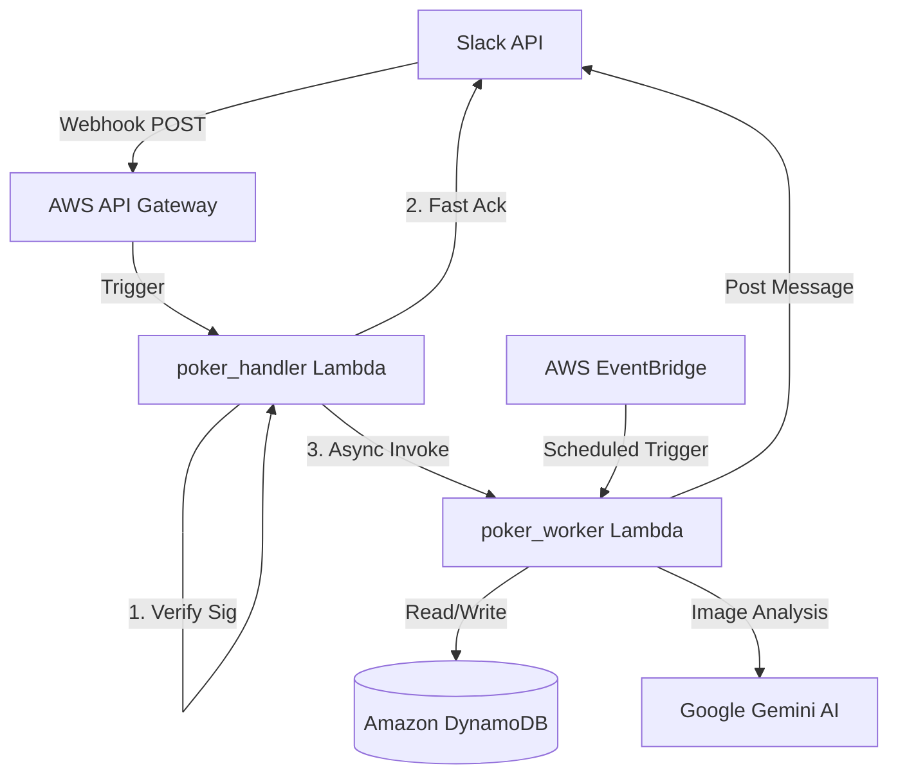

# 🛠 Developer Guide

This document provides a deep dive into the architecture, design decisions, and internal logic of PokerBot.

---

## 📐 Architecture

PokerBot is built on a serverless architecture using AWS. It follows an asynchronous processing pattern to stay within Slack's 3-second response limit.

### High-Level Diagram



### Components

1.  **poker_handler (Lambda):**
    - Responsible for signature verification (security).
    - Handles the Slack "challenge" during app setup.
    - Asynchronously invokes the `poker_worker` so Slack receives a `200 OK` immediately.
2.  **poker_worker (Lambda):**
    - The "brain" of the bot.
    - Dispatches logic based on event type (mention, interactive action, or scheduled event).
3.  **DynamoDB:**
    - Single-table design (PK/SK).
    - `PK: USER#<slack_id>`, `SK: PROFILE`: Stores poker name and Venmo handle.
    - `PK: POLL#<week_id>`, `SK: METADATA`: Stores the message ID and randomized emoji-to-day mapping for the week's poll.
4.  **Google Gemini 1.5 Flash:**
    - Used for Multimodal Vision (screenshot parsing) and Natural Language Processing.

---

## 🧠 Core Logic & Design Decisions

### Settlement Algorithm (`settlement.py`)
The bot uses a "Greedy Settlement" approach:
1.  Separate players into **Winners** and **Losers**.
2.  Sort both lists by the absolute amount (highest to lowest).
3.  Match the biggest loser with the biggest winner.
4.  Calculate the transfer (min of both amounts) and update the tally.
5.  Repeat until all balances are zero.
*Decision:* This minimizes the total number of transactions, making it easier for the group to settle up.

### Vision Processing (`vision.py`)
Instead of brittle OCR and regex, we use **Gemini 1.5 Flash**.
- **Input:** Image bytes from Slack + specialized prompt.
- **Output:** Structured JSON with net amounts.
- **Validation:** The worker verifies that the sum of all extracted net amounts is zero before proceeding.

### Reaction-Based Polling
To avoid interactive button timeouts and preserve a traditional voting feel:
1.  **Generation:** The bot picks 5 random unique emojis from a curated list.
2.  **Seeding:** It posts a text message and immediately adds those 5 emojis as reactions.
3.  **Tallying:** When results are requested, the bot fetches the live reaction counts from Slack, subtracts its own "seed" reaction, and maps the emojis back to their assigned days using metadata stored in DynamoDB.

### Local Development Bridge (`local_bridge.py`)
Since AWS Lambda is hard to debug locally, we use a Flask-based bridge that:
- Listens for Slack webhooks locally.
- Mimics the API Gateway event format.
- Directly calls the `lambda_handler` in the worker logic.
- Works with **DynamoDB Local** and **ngrok**.

---

## ⚙️ Configuration

### Environment Variables
| Variable | Description | Location |
| :--- | :--- | :--- |
| `SLACK_BOT_TOKEN` | Bot User OAuth Token | Secrets Manager |
| `SLACK_SIGNING_SECRET` | For request verification | Secrets Manager |
| `GOOGLE_API_KEY` | For Gemini AI | Secrets Manager |
| `DYNAMODB_TABLE` | Main data table | Terraform |
| `POKER_CHANNEL` | Slack channel name for polls | Terraform |

### Adjusting the Poll Schedule
The polling interval is defined in `main.tf` under `aws_cloudwatch_event_rule.eb_trigger`. For development, it's set to every 3 minutes. For production, you should change it to a cron expression:
```hcl
# Example for every Monday at 10:00 AM UTC
schedule_expression = "cron(0 10 ? * MON *)"
```

---

## 🧪 Local Setup (Detailed)

### Environment Variables
The bot requires several environment variables (see `main.tf` for the full list). In local development, these are loaded from a `.env` file generated by `./scripts/fetch_secrets.sh`.

### Database Initialization
When using DynamoDB local, you must initialize the table schema:
```bash
python scripts/init_local_db.py
```

### Running the Bridge
```bash
python local_bridge.py
```
Then point `ngrok` to port 5000:
```bash
ngrok http 5000
```

To manually trigger a weekly poll for testing:
```bash
curl -X POST http://localhost:5000/trigger-poll
```

---

## 🚢 CI/CD & Deployment

### Packaging
Lambdas are packaged using `build.sh`. This script uses a Docker container (`amazonlinux`) to install dependencies, ensuring that C-extensions (like `cryptography` or `grpcio`) are compatible with the AWS Lambda environment.

### Terraform
`main.tf` manages:
- IAM Roles & Policies.
- API Gateway & Lambda configurations.
- DynamoDB Table.
- EventBridge Rules (scheduling).
- Secrets Manager references.
