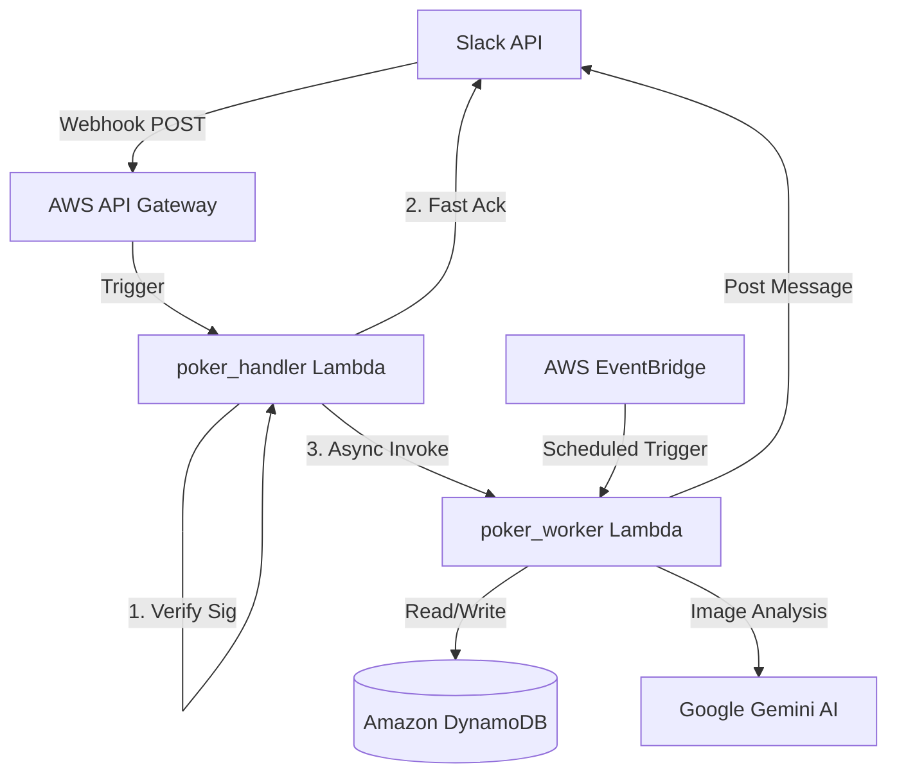

# 🛠 Developer Guide

This document provides a deep dive into the architecture, design decisions, and internal logic of PokerBot.

---

## 📐 Architecture

PokerBot is built on a serverless architecture using AWS. It follows an asynchronous processing pattern to stay within Slack's 3-second response limit.

### High-Level Diagram



### Components

1.  **poker_handler (Lambda):**
    - Responsible for signature verification (security).
    - Handles the Slack "challenge" during app setup.
    - Asynchronously invokes the `poker_worker`.
2.  **poker_worker (Lambda):**
    - The "brain" of the bot.
    - Manages agentic conversations and dispatches tools.
3.  **DynamoDB:**
    - Single-table design (PK/SK).
    - `PK: USER#<slack_id>`, `SK: PROFILE`: User data.
    - `PK: GAME#<game_id>`, `SK: RESULT`: Game records.
    - `PK: STATS#<name>`, `SK: GAME#<game_id>`: Player history.
4.  **Google Gemini:**
    - Multimodal Vision for parsing screenshots and NLP for the bot agent.

---

## 🧠 Core Logic & Design Decisions

### Settlement Algorithm (`settlement.py`)
The bot uses a "Greedy Settlement" approach to minimize the number of transactions between players.

### Vision Processing (`vision.py`)
Uses **Gemini Vision** to extract structured JSON from Pokerrrr 2 screenshots, converting raw units (cents) into dollars.

### Local Development Bridge (`dev/local_bridge.py`)
A Flask-based bridge that mimics AWS Lambda locally, allowing for rapid testing with **ngrok** and **DynamoDB Local**.

---

## ⚙️ Configuration

### Environment Variables
Managed via AWS Secrets Manager and Terraform. Use `make secrets` to sync them locally to a `.env` file.

---

## 🧪 Local Setup (Detailed)

### 1. Sync Secrets
```bash
make secrets
```

### 2. Database Initialization
```bash
make init-db
```

### 3. Running the Local Stack
Using Docker Compose:
```bash
make local
```

Or running the bridge manually:
```bash
python dev/local_bridge.py
```

### 4. Testing
Run unit tests:
```bash
make test
```

Trigger a manual poll event:
```bash
curl -X POST http://localhost:5000/trigger-poll
```

---

## 🚢 CI/CD & Deployment

### Packaging
Lambdas are packaged using `make build`. This uses a Docker container to ensure binary compatibility for dependencies.

### Terraform
Managed in the `infra/` directory. Deploy with `make deploy`.
```bash
make deploy
```
```bash
make destroy
```
